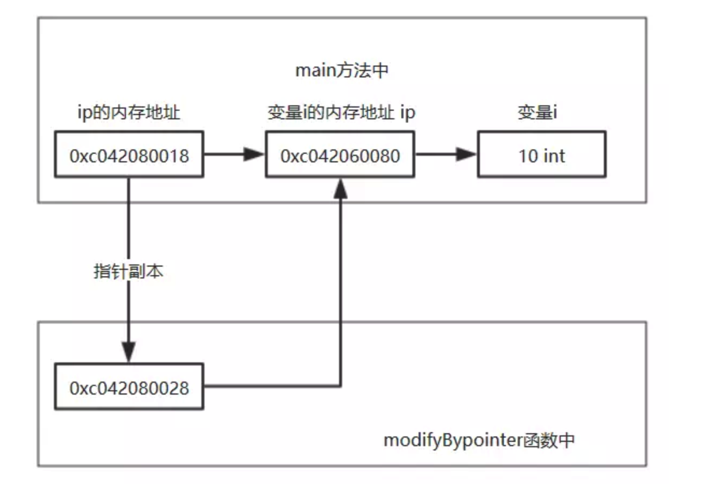

# 附1- Go语言 是值传递 or 引用传递？

我们知道在内存中的任何东西都有自己的内存地址，普通值，指针都有自己的内存地址

```go
i := 10
ip := &i
//i的内存地址为: 0xc042060080,i的指针的内存地址为 0xc042080018
```

​	比如 我们创建一个整型变量 i，该变量的值为10，有一个指向整型变量 i 的指针ip，该ip包含了 i 的内存地址 0xc042060080 。但是ip也有自己的内存地址 0xc042080018。

## 非引用类型	

首先我们知道对于非引用类型：整型，字符串，布尔，数组在当作参数传递时，是传递副本的内存地址，也就是值传递

```go
func main() {
   i := 10 //整形变量 i
   ip := &i //指向整型变量 i 的指针ip,包含了 i 的内存地址
   fmt.Printf("main中i的值为：%v，i 的内存地址为：%v，i的指针的内存地址为：%v\n",i,ip,&ip)
   modifyBypointer(i)
   fmt.Printf("main中i的值为：%v，i 的内存地址为：%v，i的指针的内存地址为：%v\n",i,ip,&ip)
}

func modify(i int) {
   fmt.Printf("modify i 为：%v，i的指针的内存地址为：%v\n",i,&i)
   i = 11
}

----output---- 
main中 i 的值为：10，i 的内存地址为：0xc0420080b8，i 的指针的内存地址为：0xc042004028
modify i 为：10，i 的指针的内存地址为：0xc0420080d8
main中 i 的值为：10，i 的内存地址为：0xc0420080b8，i 的指针的内存地址为：0xc042004028
```

上面在函数接收的参数中没有使用指针，所以在传递参数时，传递的是该值的副本，内存地址会改变，因此在函数中对该变量进行操作不会影响到原变量的值。


如果我将上面函数的参数传递方式改一下，改为接收参数的指针

```go
func main() {
   i := 10 //整形变量 i
   ip := &i //指向整型变量 i 的指针ip,包含了 i 的内存地址
   fmt.Printf("main中i的值为：%v，i 的内存地址为：%v，i的指针的内存地址为：%v\n",i,ip,&ip)
   modifyBypointer(ip)
   fmt.Printf("main中i的值为：%v，i 的内存地址为：%v，i的指针的内存地址为：%v\n",i,ip,&ip)
}

func modifyBypointer(i *int) {
   fmt.Printf("modifyBypointer i 的内存地址为：%v，i的指针的内存地址为：%v\n",i,&i)
   *i = 11
}

---output---
main中i的值为：10，i 的内存地址为：0xc042060080，i的指针ip的内存地址为：0xc042080018
modifyBypointer i 的内存地址为：0xc042060080，i的指针ip的内存地址为：0xc042080028
main中i的值为：11，i 的内存地址为：0xc042060080，i的指针ip的内存地址为：0xc042080018
```



到目前为止，我们验证了非引用类型和指针的参数传递都是传递副本，那么对于引用类型的参数传递又是如何的呢？

## 引用类型

​	通过类似的实验，可以确定 map和chan等引用类型均是值传递。	

​	当是slice类型的时候，fmt.Printf返回是slice这个结构体里第一个元素的地址。说到底，又转变成了指针处理，只不过这个指针是slice中第一个元素的内存地址。之前说Slice类型对于之前的map，chan类型不太一样，不一样就在于slice是一种结构体+第一个元素指针的混合类型，通过元素array(Data)的指针，可以达到修改slice里存储元素的目的。

## 总结

​	总结：在Go语言中只存在值传递（要么是该值的副本，要么是指针的副本），不存在引用传递。之所以对于引用类型的传递可以修改原内容数据，是因为在底层默认使用该引用类型的指针进行传递，但是也是使用指针的副本，依旧是值传递。

​	变量s储存在栈区，其地址为0x000050420，而其值并不是数组[1, 2, 3]，而是存放的数组[1, 2, 3]的地址。该数组存放在堆区，地址为0x000074080(第一个元素的地址，后面开辟了连续的地址空间存放后续元素)。
​	因此，不难想到，将切片传入函数中，形参是实参值的拷贝，此时虽然形参和实参本身是不同的内存空间，但他们的值使得各自都指向同一底层数组，因此当形参改变时(添加元素，改变某元素值），函数调用后实参同样会被改变(其实是指向的底层数组的改变)，这和其他一些类型传入函数时有很大不同。


