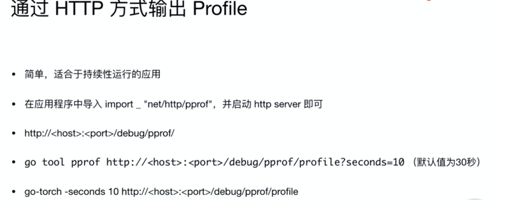

# 30|性能分析

## 代码注入

profile文件的生成，这种使用代码注入的方式灵活性较高

```go
package main

import (
   "log"
   "math/rand"
   "os"
   "runtime"
   "runtime/pprof"
   "time"
)

const (
   col = 10000
   row = 10000
)

func fillMatrix(m *[row][col]int) {
   s := rand.New(rand.NewSource(time.Now().UnixNano()))

   for i := 0; i < row; i++ {
      for j := 0; j < col; j++ {
         m[i][j] = s.Intn(100000)
      }
   }
}

func calculate(m *[row][col]int) {
   for i := 0; i < row; i++ {
      tmp := 0
      for j := 0; j < col; j++ {
         tmp += m[i][j]
      }
   }
}

func main() {
   //创建输出文件
   f, err := os.Create("cpu.prof")
   if err != nil {
      log.Fatal("could not create CPU profile: ", err)
   }

   // 获取系统信息
   if err := pprof.StartCPUProfile(f); err != nil { //监控cpu
      log.Fatal("could not start CPU profile: ", err)
   }
   defer pprof.StopCPUProfile()

   // 主逻辑区，进行一些简单的代码运算
   x := [row][col]int{}
   fillMatrix(&x)
   calculate(&x)

   f1, err := os.Create("mem.prof")
   if err != nil {
      log.Fatal("could not create memory profile: ", err)
   }
   runtime.GC()                                       // GC，获取最新的数据信息
   if err := pprof.WriteHeapProfile(f1); err != nil { // 写入内存信息
      log.Fatal("could not write memory profile: ", err)
   }
   f1.Close()

   f2, err := os.Create("goroutine.prof")
   if err != nil {
      log.Fatal("could not create groutine profile: ", err)
   }

   if gProf := pprof.Lookup("goroutine"); gProf == nil {
      log.Fatal("could not write groutine profile: ")
   } else {
      gProf.WriteTo(f2, 0)
   }
   f2.Close()

}
```

## 文件分析

```
➜  4_profile go build prof.go 
➜  4_profile ls
prof    prof.go
➜  4_profile ./prof 
➜  4_profile go tool pprof prof cpu.prof 
File: prof
Type: cpu
Time: Mar 8, 2020 at 11:08pm (CST)
Duration: 1.56s, Total samples = 1.33s (84.99%)
Entering interactive mode (type "help" for commands, "o" for options)
(pprof) 
//flat时间表示函数本身运行时间，cum表示函数包括其调用的函数的运行时间
(pprof) top
Showing nodes accounting for 1330ms, 100% of 1330ms total
      flat  flat%   sum%        cum   cum%
    1290ms 96.99% 96.99%     1290ms 96.99%  main.fillMatrix
      40ms  3.01%   100%       40ms  3.01%  main.calculate
         0     0%   100%     1330ms   100%  main.main
         0     0%   100%     1330ms   100%  runtime.main
//list命令可以展开某一函数具体运行时长以及瓶颈在哪
(pprof) list fillMatrix
Total: 1.33s
ROUTINE ======================== main.fillMatrix in /Users/enbowang/go/src/performance/4_profile/prof.go
     1.29s      1.29s (flat, cum) 96.99% of Total
         .          .     17:func fillMatrix(m *[row][col]int) {
         .          .     18:   s := rand.New(rand.NewSource(time.Now().UnixNano()))
         .          .     19:
         .          .     20:   for i := 0; i < row; i++ {
         .          .     21:           for j := 0; j < col; j++ {
     1.29s      1.29s     22:                   m[i][j] = s.Intn(100000)
         .          .     23:           }
         .          .     24:   }
         .          .     25:}
         .          .     26:
         .          .     27:func calculate(m *[row][col]int) {
(pprof) 
//svg命令生成可视化图表
(pprof) svg
Generating report in profile001.svg
(pprof)
```

## 使用http服务对运行中的任务进行监控



## 通过go test直接生成profile

```
go test -bench=. -cpuprofile=cpu.prof
```

