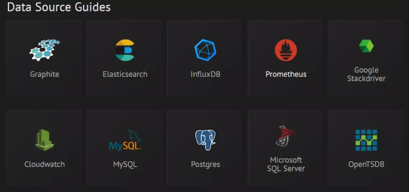

# 数据可视化|Grafana

> grafana 是一款采用 go 语言编写的开源应用，主要用于大规模指标数据的可视化展现，是网络架构和应用分析中最流行的**时序数据展示**工具，目前已经支持绝大部分常用的时序数据库。最好的参考资料就是官网（[http://docs.grafana.org/](https://links.jianshu.com/go?to=http%3A%2F%2Fdocs.grafana.org%2F)）

## 1.基本概念

Grafana支持许多不同的数据源。每个数据源都有一个特定的查询编辑器,该编辑器定制的特性和功能是公开的特定数据来源。 官方支持以下数据源:Graphite，Elasticsearch，InfluxDB，Prometheus，Cloudwatch，MySQL和OpenTSDB等。

每个数据源的查询语言和能力都是不同的。你可以把来自多个数据源的数据组合到一个仪表板，但每一个面板被绑定到一个特定的数据源,它就属于一个特定的组织。



## 部署 for macOS

可参考（[grafana官网安装说明](https://grafana.com/docs/grafana/latest/installation/mac/)、[grafana酷炫图表](https://links.jianshu.com/go?to=http%3A%2F%2Fblog.51cto.com%2F13447608%2F2299747)）

## Install using homebrew

Installation can be done using [homebrew](http://brew.sh/)

Install latest stable:

```bash
brew update
brew install grafana
```

To start grafana look at the command printed after the homebrew install completes.

To upgrade use the reinstall command

```bash
brew update
brew reinstall grafana
```

------

You can also install the latest unstable grafana from git:

```bash
brew install --HEAD grafana/grafana/grafana
```

To upgrade grafana if you’ve installed from HEAD:

```bash
brew reinstall --HEAD grafana/grafana/grafana
```

### Start Grafana

To start Grafana using homebrew services first make sure homebrew/services is installed.

```bash
brew tap homebrew/services
```

Then start Grafana using:

```bash
brew services start grafana
```

Default login and password `admin`/ `admin`

## Install from binary tar file

Download [the latest `.tar.gz` file](https://grafana.com/get) and extract it. This will extract into a folder named after the version you downloaded. This folder contains all files required to run Grafana. There are no init scripts or install scripts in this package.

To configure Grafana add a configuration file named `custom.ini` to the `conf` folder and override any of the settings defined in `conf/defaults.ini`.

### Start Grafana

Start Grafana by executing `./bin/grafana-server`. The `grafana-server` binary needs the working directory to be the root install directory (where the binary and the `public` folder is located).